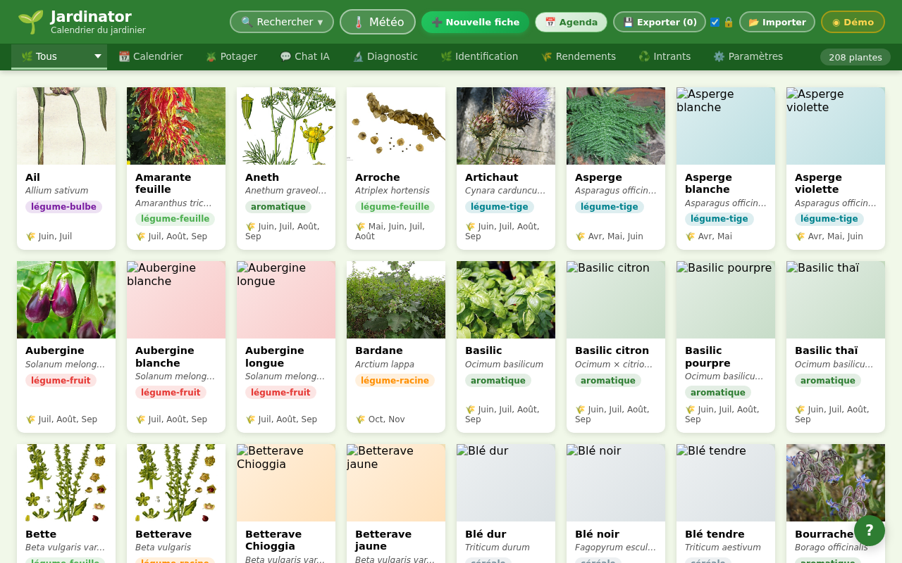
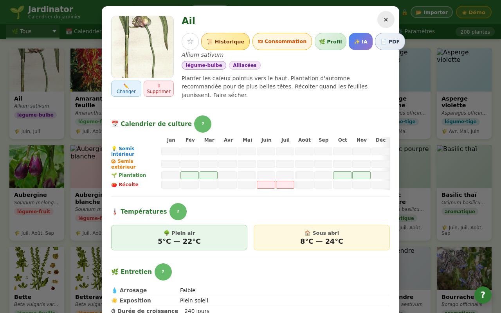
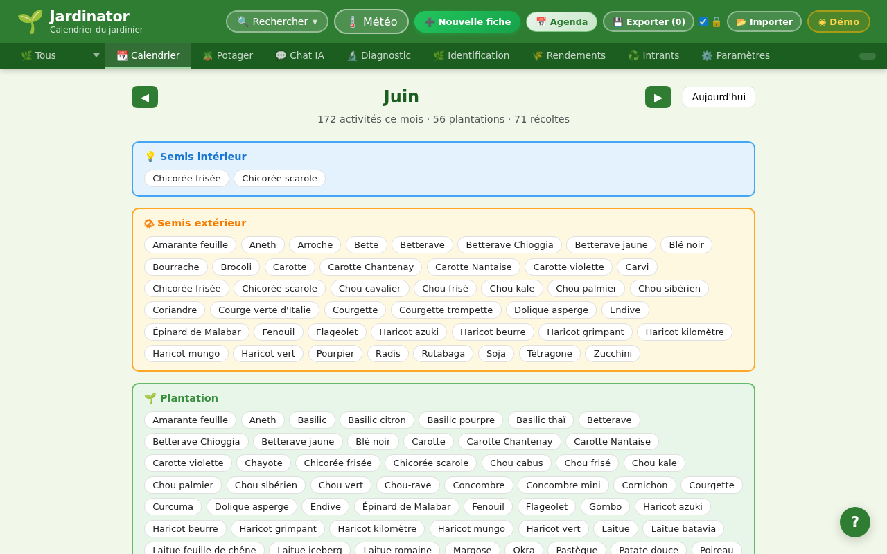
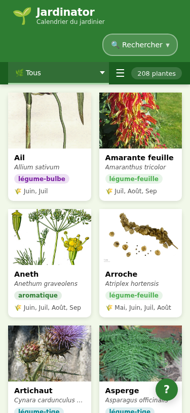
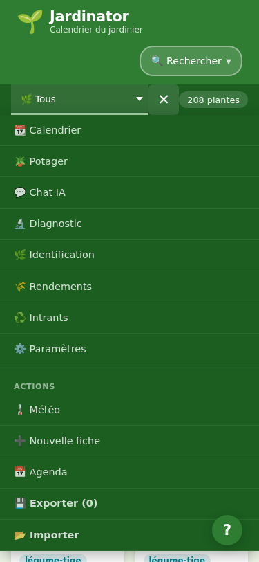

# 🌱 Jardinator

**Calendrier du jardinier** — application web pour planifier semis, plantations et récoltes tout au long de l'année.

---

## Captures d'écran

### Vue principale — Desktop



### Fiche plante



### Calendrier mensuel



### Mobile — Header



### Mobile — Menu ☰



---

## Fonctionnalités

- **208 plantes** avec fiches détaillées (semis, plantation, récolte, températures, associations)
- **Calendrier mensuel** — activités du mois groupées par type (semis intérieur/extérieur, plantation, récolte)
- **Recherche & filtres** — par nom, groupe, famille, zone climatique européenne
- **Plan du potager** — disposition visuelle des planches
- **Chat IA** — conseils personnalisés via l'API Gemini
- **Diagnostic phytosanitaire** — identification de maladies et ravageurs
- **Identification de plantes** — reconnaissance par photo
- **Météo** — conditions en temps réel et recommandations
- **Export/Import** — sauvegarde complète des données en JSON
- **Export Agenda** — dates clés au format `.ics` (Google Calendar, Apple Calendar)
- **Mode hors-ligne** — navigation locale disponible sans connexion

---

## Stack technique

| Outil | Rôle |
|---|---|
| [React 18](https://react.dev/) | UI |
| [Vite](https://vite.dev/) | Build & dev server |
| [Zustand](https://zustand-demo.pmnd.rs/) | État global |
| JSON statiques | Données des plantes |
| CSS natif | Styles (pas de framework UI) |

---

## Lancer en local

```bash
npm install
npm run dev
# → http://localhost:5173
```

```bash
npm run build   # build de production
npm run preview # prévisualiser le build
```
